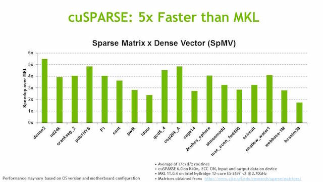
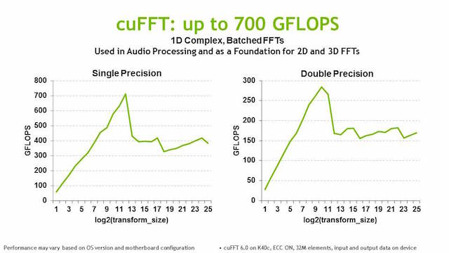
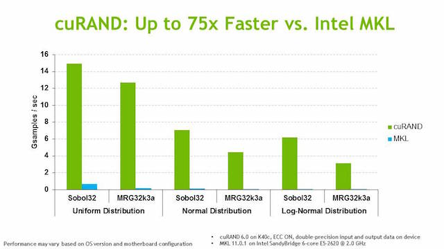

# CUDA Programming

The goal of this document is only to make it easier for new developpers to undestand the overall CUDA paradigm and NVIDIA GPU features.  

This document is just a high level overview of CUDA features and CUDA programming model. It is probably simpler to read it before installing the CUDA Toolkit, reading the CUDA C Programming guide, CUDA Runtime API and code samples.  

**For a complete and deep overview of the CUDA Toolkit and CUDA Runtime API and CUDA Libraries, please consult NVIDIA websites:**

* The CUDA Zone:
    * [https://developer.nvidia.com/cuda-zone](https://developer.nvidia.com/cuda-zone)  
* Join The CUDA Registered Developer Program:
    * [https://developer.nvidia.com/registered-developer-program](https://developer.nvidia.com/registered-developer-program)  
* Information about the CUDA Toolkit:
    * [https://developer.nvidia.com/cuda-toolkit](https://developer.nvidia.com/cuda-toolkit)  
* Download the latest CUDA Toolkit (Mac OSX / Linux x86 / Linux ARM / Windows):
    * [https://developer.nvidia.com/cuda-downloads](https://developer.nvidia.com/cuda-downloads)  

----------------------------

## Table of contents

* [Introduction](#introduction)
    * [Terminology](#terminology)
* [Thread Hierarchy](#threadhierarchy)
    * [Kernel](#kernel)
    * [Thread](#thread)
    * [Warp](#warp)
    * [Block](#block)
    * [Grid](#grid)
* [Memory](#memory)
    * [Host Memory](#hostmemory)
        * [Page-Locked Host Memory](#pagelockedhostmemory)
    * [Device Memory](#devicememory)
    * [Unified Memory](#unifiedmemory)
* [Asynchronous Concurrency Execution](#asynchronousconcurrencyexecution)
    * [Concurrent Data Access](#Concurrent Data Access)
        * [Synchronize Functions](#synchronizefunctions)
        * [Atomic Functions](#atomicfunctions)
    * [Concurrent Kernel Execution](#concurrentkernelexecution)
    * [Concurrent Data Transfers](#concurrentdatatransfers)
    * [Streams](#streams)
        * [Callbacks](#callbacks)
        * [Events](#events)
    * [Dynamic Parallelism](#dynamicparallelism)
* [Multi-Device System](#multidevicesystem)
    * [Stream and Event Behavior](#streamandeventbehavior)
    * [GPU Direct](#gpudirect)
* [Versioning and Compatibility](#versioningandcompatibility)
* [Parallel Libraries](#parallellibraries)
    * [cuBLAS](#cublas)
    * [cuSPARSE](#cusparse)
    * [cuSOLVER](#cusolver)
    * [cuFFT](#cufft)
    * [cuRAND](#curand)
    * [cuDNN](#dnn)
    * [NPP](#npp)

----------------------------

##   Introduction

GPU is specialized for compute-intensive, highly parallel computation - exactly what graphics rendering is about - and therefore designed such that more transistors are devoted to data processing rather than data caching and flow control.

The NVIDIA GPU architecture is built around a scalable array of multithreaded Streaming Multiprocessors (SMs). When a CUDA program on the host CPU invokes a kernel grid, the blocks of the grid are enumerated and distributed to multiprocessors with available execution capacity. The threads of a thread block execute concurrently on one multiprocessor, and multiple thread blocks can execute concurrently on one multiprocessor. As thread blocks terminate, new blocks are launched on the vacated multiprocessors.

A multiprocessor is designed to execute hundreds of threads concurrently. To manage such a large amount of threads, it employs a unique architecture called SIMT (Single-Instruction, Multiple-Thread). The instructions are pipelined to leverage instruction-level parallelism within a single thread, as well as thread-level parallelism extensively through simultaneous hardware multithreading. Unlike CPU cores they are issued in order however and there is no branch prediction and no speculative execution.

###  Terminology

* __HOST__: The CPU and its memory (Host Memory)
* __DEVICE__: The GPU and its memory (Device Memory)

----------------------------

##  Thread Hierarchy

CUDA C extends C by allowing the programmer to define C functions, called kernels, that, when called, are executed N times in parallel by N different CUDA threads, as opposed to only once like regular C functions.

The CUDA programming model assumes that the CUDA threads execute on a physically separate device that operates as a coprocessor to the host running the C program. This is the case, for example, when the kernels execute on a GPU and the rest of the Golang program executes on a CPU.

Calling a kernel function from the Host launch a grid of thread blocks on the Device:

###  Kernel

###  Thread
###  Warp

The multiprocessor creates, manages, schedules, and executes threads in groups of 32 parallel threads called warps. Individual threads composing a warp start together at the same program address, but they have their own instruction address counter and register state and are therefore free to branch and execute independently. The term warp originates from weaving, the first parallel thread technology.

###  Block
###  Grid

----------------------------

| Technical Specifications per Compute Capability | 1.1 |  1.2 - 1.3 | 2.x | 3.0 - 3.2 | 3.5 | 3.7 | 5.0 | 5.2 |
|---|---|---|---|---|---|---|---|---|
| | | | | | | | | |
| __Grid__ | | | | | | | | |
| _Maximum dimensionality of grid of thread blocks_ | 2 | 2 | 3 | 3 | 3 | 3 | 3 | 3 |
| _Maximum x-dimension of a grid of thread blocks_ | 65535 | 65535 | 65535 | 2^32 | 2^32 | 2^32 | 2^32 | 2^32 |
| _Maximum y- or z-dimension of a grid of thread blocks_ | 65535 | 65535 | 65535 | 65535 | 65535 | 65535 | 65535 | 65535 |
| | | | | | | | | |
| __Block__ | | | | | | | | |
| _Maximum dimensionality of thread block_ | 3 | 3 | 3 | 3 | 3 | 3 | 3 | 3 |
| _Maximum x- or y-dimension of a block_ | 512 | 512 | 1024 | 1024 | 1024 | 1024 | 1024 | 1024 |
| _Maximum z-dimension of a block_ | 64 | 64 | 64 | 64 | 64 | 64 | 64 | 64 |
| _Maximum number of threads per block_ | 512 | 512 | 1024 | 1024 | 1024 | 1024 | 1024 | 1024 |
| | | | | | | | | |
| __Multiprocessor__ | | | | | | | | |
| _Warp size_ | 32 | 32 | 32 | 32 | 32 | 32 | 32 | 32 |
| _Maximum number of resident blocks per multiprocessor_ | 8 | 8 | 8 | 16 | 16 | 16 | 32 | 32 |
| _Maximum number of resident warps per multiprocessor_ | 24 | 32 | 48 | 64 | 64 | 64 | 64 | 64 |
| _Maximum number of resident threads per multiprocessor_ | 768 | 1024 | 1536 | 2048 | 2048 | 2048 | 2048 | 2048 |

----------------------------

##  Memory

The GPU card contains its own DRAM memory separatly from the CPU's DRAM. Let's see how these memory works and can exchange information between them.

###  Host Memory
####  Page-Locked Host Memory
###  Device Memory

CUDA threads may access data from multiple memory spaces during their execution:

* __Local memory__
    * Each thread has private local memory (__per-thread local memory__).
    * Local memory is so named because its scope is local to the thread, not because of its physical location. In fact, local memory is off-chip (=DRAM). Hence, access to local memory is as expensive as access to global memory. In other words, the term local in the name does not imply faster access.
* __Shared memory__
    * Each thread block has shared memory visible to all threads of the block and with the same lifetime as the block (__per-block shared memory__).
    * Because it is on-chip, shared memory has much higher bandwidth and lower latency than local and global memory.
* __Global memory__
    * All threads have access to the same global memory (=DRAM).

----------------------------

| Technical Specifications per Compute Capability | 1.1 |  1.2 - 1.3 | 2.x | 3.0 - 3.2 | 3.5 | 3.7 | 5.0 | 5.2 |
|---|---|---|---|---|---|---|---|---|
| | | | | | | | | |
| __Registers__ | | | | | | | | |
| _Number of 32-bit registers per multiprocessor_ | 8k | 16k | 32k | 64k | 64k | 128k | 64k | 64k |
| _Maximum number of 32-bit registers per thread block_ | | | 32k | 64k | 64k | 64k | 64k | 64k |
| _Maximum number of 32-bit registers per thread_ | 128 | 128 | 63 | 63 | 255 | 255 | 255 | 255 |
| | | | | | | | | |
| __Local Memory__ | | | | | | | | |
| _Maximum amount of local memory per thread_ | 16 KB | 16 KB | 512 KB | 512 KB | 512 KB | 512 KB | 512 KB | 512 KB |
| | | | | | | | | |
| __Shared Memory__ | | | | | | | | |
| _Maximum amount of shared memory per multiprocessor_ | 16 KB | 16 KB | 48 KB | 48 KB | 48 KB | 112 KB | 64 KB | 96 KB |
| _Maximum amount of shared memory per thread block_   | 16 KB | 16 KB | 48 KB | 48 KB | 48 KB | 48 KB  | 48 KB | 48 KB |

### Unified Memory

----------------------------

##  Asynchronous Concurrency Execution
###  Concurrent Data Access
####  Synchronize Functions
####  Atomic Functions
###  Concurrent kernel execution
###  Concurrent Data Transfers
###  Streams
####  Callbacks
####  Events
###  Dynamic Parallelism

Need Compute Capability >= 3.5

----------------------------

##  Multi-Device System

A host system can have multiple GPU Devices.

###  Stream and Event Behavior

* A kernel launch will fail if it is issued to a stream that is not associated to the current device.
* A memory copy will succeed even if it is issued to a stream that is not associated to the current device.
* Each device has its own default stream, so commands issued to the default stream of a device may execute out of order or concurrently with respect to commands issued to the default stream of any other device.

###  GPU Direct

**Accelerated communication with network and storage devices**  
Network and GPU device drivers can share “pinned” (page-locked) buffers, eliminating the need to make a redundant copy in CUDA host memory.

**Peer-to-Peer Transfers between GPUs**  
Use high-speed DMA transfers to copy data between the memories of two GPUs on the same system/PCIe bus.

**Peer-to-Peer memory access**  
Optimize communication between GPUs using NUMA-style access to memory on other GPUs from within CUDA kernels.

**RDMA**  

Eliminate CPU bandwidth and latency bottlenecks using remote direct memory access (RDMA) transfers between GPUs and other PCIe devices, resulting in significantly improved MPISendRecv efficiency between GPUs and other nodes)

**GPUDirect for Video**  
Optimized pipeline for frame-based devices such as frame grabbers, video switchers, HD-SDI capture, and CameraLink devices.

* GPUDirect version 1 supported accelerated communication with network and storage devices. It was supported by InfiniBand solutions available from Mellanox and others.
* GPUDirect version 2 added support for peer-to-peer communication between GPUs on the same shared memory server.
* GPU Direct RDMA enables RDMA transfers across an Infiniband network between GPUs in different cluster nodes, bypassing CPU host memory altogether. 

Using GPUDirect, 3rd party network adapters, solid-state drives (SSDs) and other devices can directly read and write CUDA host and device memory. GPUDirect eliminates unnecessary system memory copies, dramatically lowers CPU overhead, and reduces latency, resulting in significant performance improvements in data transfer times for applications running on NVIDIA products.

----------------------------

##  Versioning and Compatibility

* __The driver API is backward compatible__, meaning that applications, plug-ins, and libraries (including the C runtime) compiled against a particular version of the driver API will continue to work on subsequent device driver releases.

* __The driver API is not forward compatible__, which means that applications, plug-ins, and libraries (including the C runtime) compiled against a particular version of the driver API will not work on previous versions of the device driver.

* Only one version of the CUDA device driver can be installed on a system.

* All plug-ins and libraries used by an application must use the same version of:
    * any CUDA libraries (such as cuFFT, cuBLAS, ...)
    * the associated CUDA runtime.

----------------------------

##  Parallel Libraries

###  cuBLAS (Basic Linear Algebra Subroutines)

The NVIDIA CUDA Basic Linear Algebra Subroutines (cuBLAS) library is a GPU-accelerated version of the complete standard BLAS library.
    	
* Complete support for all 152 standard BLAS routines
* Single, double, complex, and double complex data types
* Support for CUDA streams
* Fortran bindings
* Support for multiple GPUs and concurrent kernels
* Batched GEMM API
* Device API that can be called from CUDA kernels
* Batched LU factorization API
* Batched matrix inverse API
* New implementation of TRSV (Triangular solve), up to 7x faster than previous implementation.

_To learn more about cuBLAS:_ [https://developer.nvidia.com/cuBLAS](https://developer.nvidia.com/cuBLAS)

###  cuSPARSE (Sparse Matrix)

The NVIDIA CUDA Sparse Matrix library (cuSPARSE) provides a collection of basic linear algebra subroutines used for sparse matrices that delivers up to 8x faster performance than the latest MKL. The latest release includes a sparse triangular solver.

Supports dense, COO, CSR, CSC, ELL/HYB and Blocked CSR sparse matrix formats
Level 1 routines for sparse vector x dense vector operations
Level 2 routines for sparse matrix x dense vector operations
Level 3 routines for sparse matrix x multiple dense vectors (tall matrix)
Routines for sparse matrix by sparse matrix addition and multiplication
Conversion routines that allow conversion between different matrix formats
Sparse Triangular Solve
Tri-diagonal solver
Incomplete factorization preconditioners ilu0 and ic0

_To learn more about cuSPARSE:_ [https://developer.nvidia.com/cuSPARSE](https://developer.nvidia.com/cuSPARSE)

###  cuSOLVER (Solver)

The NVIDIA cuSOLVER library provides a collection of dense and sparse direct solvers which deliver significant acceleration for Computer Vision, CFD, Computational Chemistry, and Linear Optimization applications.

* __cusolverDN__: Key LAPACK dense solvers 3-6x faster than MKL.
    * Dense Cholesky, LU, SVD, QR
    * Applications include: optimization, Computer Vision, CFD
* __cusolverSP__
    * Sparse direct solvers & Eigensolvers
    * Applications include: Newton's method, Chemical Kinetics
* __cusolverRF__
    * Sparse refactorization solver
    * Applications include: Chemistry, ODEs, Circuit simulation

_To learn more about cuSOLVER:_ [https://developer.nvidia.com/cuSOLVER](https://developer.nvidia.com/cuSOLVER)

###  cuFFT (Fast Fourier Transformation)

The FFT is a divide-and-conquer algorithm for efficiently computing discrete Fourier transforms of complex or real-valued data sets. It is one of the most important and widely used numerical algorithms in computational physics and general signal processing.

_To learn more about cuFFT:_ [https://developer.nvidia.com/cuFFT](https://developer.nvidia.com/cuFFT)

###  cuRAND (Random Number)

The cuRAND library provides facilities that focus on the simple and efficient generation of high-quality pseudorandom and quasirandom numbers. A pseudorandom sequence of numbers satisfies most of the statistical properties of a truly random sequence but is generated by a deterministic algorithm. A quasirandom sequence of n -dimensional points is generated by a deterministic algorithm designed to fill an n-dimensional space evenly.

Random numbers can be generated on the device or on the host CPU.

_To learn more about cuRAND:_ [https://developer.nvidia.com/cuRAND](https://developer.nvidia.com/cuRAND)

###  cuDNN (Deep Neural Network)

cuDNN is a GPU-accelerated library of primitives for deep neural networks. It provides highly tuned implementations of routines arising frequently in DNN applications:

* Convolution forward and backward, including cross-correlation
* Pooling forward and backward
* Softmax forward and backward
* Neuron activations forward and backward:
    * Rectified linear (ReLU)
    * Sigmoid
    * Hyperbolic tangent (TANH)
* Tensor transformation functions

_To learn more about cuDNN:_ [https://developer.nvidia.com/cuDNN](https://developer.nvidia.com/cuDNN)

###  NPP (NVIDIA Performance Primitive)

NVIDIA Performance Primitive (NPP) is a library of functions for performing CUDA accelerated processing. The initial set of
functionality in the library focuses on imaging and video processing and is widely applicable for developers
in these areas. NPP will evolve over time to encompass more of the compute heavy tasks in a variety of problem domains.

* __Eliminates unnecessary copying of data to/from CPU memory__
    * Process data that is already in GPU memory
    * Leave results in GPU memory so they are ready for subsequent processing
* __Data Exchange and Initialization__
    * Set, Convert, Copy, CopyConstBorder, Transpose, SwapChannels
* __Arithmetic and Logical Operations__
    * Add, Sub, Mul, Div, AbsDiff, Threshold, Compare
* __Color Conversion__
    * RGBToYCbCr, YcbCrToRGB, YCbCrToYCbCr, ColorTwist, LUT_Linear
* __Filter Functions__
    * FilterBox, Filter, FilterRow, FilterColumn, FilterMax, FilterMin, Dilate, Erode, SumWindowColumn, SumWindowRow
* __JPEG__
    * DCTQuantInv, DCTQuantFwd, QuantizationTableJPEG
* __Geometry Transforms__
    * Mirror, WarpAffine, WarpAffineBack, WarpAffineQuad, WarpPerspective, WarpPerspectiveBack  , WarpPerspectiveQuad, Resize
* __Statistics Functions__
    * Mean_StdDev, NormDiff, Sum, MinMax, HistogramEven, RectStdDev

_To learn more about NPP:_ [https://developer.nvidia.com/NPP](https://developer.nvidia.com/NPP)
