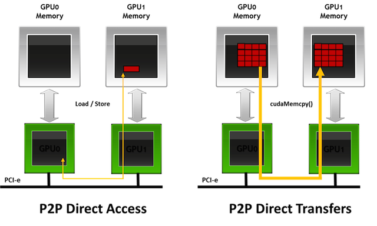
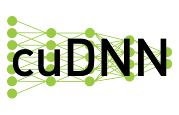

# CUDA Programming

The goal of this document is only to make it easier for new developpers to undestand the overall CUDA paradigm and NVIDIA GPU features.  

This document is just a high level overview of CUDA features and CUDA programming model. It is probably simpler to read it before installing the CUDA Toolkit, reading the CUDA C Programming guide, CUDA Runtime API and code samples.  

**For a complete and deep overview of the CUDA Toolkit and CUDA Runtime API and CUDA Libraries, please consult NVIDIA websites:**

* The CUDA Zone:
    * [https://developer.nvidia.com/cuda-zone](https://developer.nvidia.com/cuda-zone)  
* Join The CUDA Registered Developer Program:
    * [https://developer.nvidia.com/registered-developer-program](https://developer.nvidia.com/registered-developer-program)  
* Information about the CUDA Toolkit:
    * [https://developer.nvidia.com/cuda-toolkit](https://developer.nvidia.com/cuda-toolkit)  
* Download the latest CUDA Toolkit (Mac OSX / Linux x86 / Linux ARM / Windows):
    * [https://developer.nvidia.com/cuda-downloads](https://developer.nvidia.com/cuda-downloads)  

----------------------------

## Table of contents

* [Introduction](#introduction)
    * [Terminology](#terminology)
* [Thread Hierarchy](#threadhierarchy)
    * [Kernel](#kernel)
    * [Thread](#thread)
    * [Warp](#warp)
    * [Block](#block)
    * [Grid](#grid)
* [Memory](#memory)
    * [Host Memory](#hostmemory)
        * [Page-Locked Host Memory](#pagelockedhostmemory)
    * [Device Memory](#devicememory)
        * [Local Memory](#localmemory)
        * [Shared Memory](#sharedmemory)
        * [Global Memory](#globalmemory)
    * [Unified Memory](#unifiedmemory)
* [Asynchronous Concurrency Execution](#asynchronousconcurrencyexecution)
    * [Concurrent Data Access](#Concurrent Data Access)
        * [Synchronize Functions](#synchronizefunctions)
        * [Atomic Functions](#atomicfunctions)
    * [Concurrent Kernel Execution](#concurrentkernelexecution)
    * [Concurrent Data Transfers](#concurrentdatatransfers)
    * [Streams](#streams)
        * [Callbacks](#callbacks)
        * [Events](#events)
    * [Dynamic Parallelism](#dynamicparallelism)
* [Multi-Device System](#multidevicesystem)
    * [Stream and Event Behavior](#streamandeventbehavior)
    * [Peer-to-peer](#peertopeer)
* [Versioning and Compatibility](#versioningandcompatibility)
* [Parallel Libraries](#parallellibraries)
    * [cuBLAS](#cublas)
    * [cuSPARSE](#cusparse)
    * [cuSOLVER](#cusolver)
    * [cuFFT](#cufft)
    * [cuRAND](#curand)
    * [cuDNN](#dnn)
    * [NPP](#npp)

----------------------------

##   Introduction

GPU is specialized for compute-intensive, highly parallel computation - exactly what graphics rendering is about - and therefore designed such that more transistors are devoted to data processing rather than data caching and flow control.

The NVIDIA GPU architecture is built around a scalable array of multithreaded Streaming Multiprocessors (SMs). When a CUDA program on the host CPU invokes a kernel grid, the blocks of the grid are enumerated and distributed to multiprocessors with available execution capacity. The threads of a thread block execute concurrently on one multiprocessor, and multiple thread blocks can execute concurrently on one multiprocessor. As thread blocks terminate, new blocks are launched on the vacated multiprocessors.

A multiprocessor is designed to execute hundreds of threads concurrently. To manage such a large amount of threads, it employs a unique architecture called SIMT (Single-Instruction, Multiple-Thread). The instructions are pipelined to leverage instruction-level parallelism within a single thread, as well as thread-level parallelism extensively through simultaneous hardware multithreading. Unlike CPU cores they are issued in order however and there is no branch prediction and no speculative execution.

###  Terminology

* __HOST__: The CPU and its memory (Host Memory)
* __DEVICE__: The GPU and its memory (Device Memory)

----------------------------

##  Thread Hierarchy

CUDA C extends C by allowing the programmer to define C functions, called kernels, that, when called, are executed N times in parallel by N different CUDA threads, as opposed to only once like regular C functions.

The CUDA programming model assumes that the CUDA threads execute on a physically separate device that operates as a coprocessor to the host running the C program. This is the case, for example, when the kernels execute on a GPU and the rest of the Golang program executes on a CPU.

Calling a kernel function from the Host launch a grid of thread blocks on the Device:

###  Kernel

###  Thread
###  Warp

The multiprocessor creates, manages, schedules, and executes threads in groups of 32 parallel threads called warps. Individual threads composing a warp start together at the same program address, but they have their own instruction address counter and register state and are therefore free to branch and execute independently. The term warp originates from weaving, the first parallel thread technology.

###  Block
###  Grid

----------------------------

##  Memory

The GPU card contains its own DRAM memory separatly from the CPU's DRAM. Let's see how these memory works and can exchange information between them.

###  Host Memory
####  Page-Locked Host Memory
###  Device Memory

There is 3 memory types inside the GPU Device:

* Local memory
* Shared memory
* Global memory

####  Local Memory

Every thread owns its personal local memory for storing kernel's parameters and kernel variables associated (**per-thread local memory**).

Local memory is so named because its scope is local to the thread, not because of its physical location. In fact, local memory is off-chip. Hence, access to local memory is as expensive as access to global memory. In other words, the term local in the name does not imply faster access. Local memory is used only to hold automatic variables.

####  Shared Memory

If desired, every thread block can use allocate a specific amount of shared memory for storing variables that will be accessed very often by the thread block. All the threads inside the same block can access to this shared memory (**per-block shared memory**).

Because it is on-chip, shared memory has much higher bandwidth and lower latency than local and global memory.

####  Global Memory

### Unified Memory

----------------------------

##  Asynchronous Concurrency Execution
###  Concurrent Data Access
####  Synchronize Functions
####  Atomic Functions
###  Concurrent kernel execution
###  Concurrent Data Transfers
###  Streams
####  Callbacks
####  Events
###  Dynamic Parallelism

Need Compute Capability >= 3.5

----------------------------

##  Multi-Device System

A host system can have multiple GPU Devices.

###  Stream and Event Behavior

* A kernel launch will fail if it is issued to a stream that is not associated to the current device.
* A memory copy will succeed even if it is issued to a stream that is not associated to the current device.
* Each device has its own default stream, so commands issued to the default stream of a device may execute out of order or concurrently with respect to commands issued to the default stream of any other device.

###  Peer-to-Peer

#### Peer-to-Peer Memory Access

* When the application is run as a 64-bit process, devices of compute capability 2.0 and higher from the Tesla series may address each other's memory (i.e., a kernel executing on one device can dereference a pointer to the memory of the other device).
* A unified address space is used for both devices (see Unified Virtual Address Space), so the same pointer can be used to address memory from both devices.

#### Peer-to-Peer Memory Copy

* Memory copies can be performed between the memories of two different devices.
* Consistent with the normal behavior of streams, an asynchronous copy between the memories of two devices may overlap with copies or kernels in another stream.

----------------------------

##  Versioning and Compatibility

* __The driver API is backward compatible__, meaning that applications, plug-ins, and libraries (including the C runtime) compiled against a particular version of the driver API will continue to work on subsequent device driver releases.

* __The driver API is not forward compatible__, which means that applications, plug-ins, and libraries (including the C runtime) compiled against a particular version of the driver API will not work on previous versions of the device driver.

* Only one version of the CUDA device driver can be installed on a system.

* All plug-ins and libraries used by an application must use the same version of:
    * any CUDA libraries (such as cuFFT, cuBLAS, ...)
    * the associated CUDA runtime.

----------------------------

##  Parallel Libraries

###  cuBLAS

The cuBLAS library is an implementation of BLAS (Basic Linear Algebra Subprograms) on top of the CUDA runtime. It allows the user to access the computational resources of NVIDIA Graphics Processing Unit (GPU).

###  cuSPARSE

The cuSPARSE library contains a set of basic linear algebra subroutines used for handling sparse matrices. The library routines can be classified into four categories:

* Level 1: operations between a vector in sparse format and a vector in dense format
* Level 2: operations between a matrix in sparse format and a vector in dense format
* Level 3: operations between a matrix in sparse format and a set of vectors in dense format (which can also usually be viewed as a dense tall matrix)
* Conversion: operations that allow conversion between different matrix formats

###  cuSOLVER

The cuSolver library is a high-level package based on the cuBLAS and cuSPARSE libraries. It combines three separate libraries under a single umbrella, each of which can be used independently or in concert with other toolkit libraries.
The intent of cuSolver is to provide useful LAPACK-like features, such as common matrix factorization and triangular solve routines for dense matrices, a sparse least-squares solver and an eigenvalue solver. In addition cuSolver provides a new refactorization library useful for solving sequences of matrices with a shared sparsity pattern.

* The first part of cuSolver is called __cuSolverDN__, and deals with dense matrix factorization and solve routines such as LU, QR, SVD and LDLT, as well as useful utilities such as matrix and vector permutations.
* Next, __cuSolverSP__ provides a new set of sparse routines based on a sparse QR factorization. Not all matrices have a good sparsity pattern for parallelism in factorization, so the cuSolverSP library also provides a CPU path to handle those sequential-like matrices. For those matrices with abundant parallelism, the GPU path will deliver higher performance. The library is designed to be called from C and C++.
* The final part is __cuSolverRF__, a sparse re-factorization package that can provide very good performance when solving a sequence of matrices where only the coefficients are changed but the sparsity pattern remains the same.

###  cuFFT

The FFT is a divide-and-conquer algorithm for efficiently computing discrete Fourier transforms of complex or real-valued data sets. It is one of the most important and widely used numerical algorithms in computational physics and general signal processing.

###  cuRAND

The cuRAND library provides facilities that focus on the simple and efficient generation of high-quality pseudorandom and quasirandom numbers. A pseudorandom sequence of numbers satisfies most of the statistical properties of a truly random sequence but is generated by a deterministic algorithm. A quasirandom sequence of n -dimensional points is generated by a deterministic algorithm designed to fill an n -dimensional space evenly.

Random numbers can be generated on the device or on the host CPU.

###  cuDNN (Deep Neural Network)

cuDNN is a GPU-accelerated library of primitives for deep neural networks. It provides highly tuned implementations of routines arising frequently in DNN applications:

* Convolution forward and backward, including cross-correlation
* Pooling forward and backward
* Softmax forward and backward
* Neuron activations forward and backward:
    * Rectified linear (ReLU)
    * Sigmoid
    * Hyperbolic tangent (TANH)
* Tensor transformation functions

###  NPP

NVIDIA Performance Primitive (NPP) is a library of functions for performing CUDA accelerated processing. The initial set of
functionality in the library focuses on imaging and video processing and is widely applicable for developers
in these areas. NPP will evolve over time to encompass more of the compute heavy tasks in a variety of
problem domains. The NPP library is written to maximize flexibility, while maintaining high performance.

